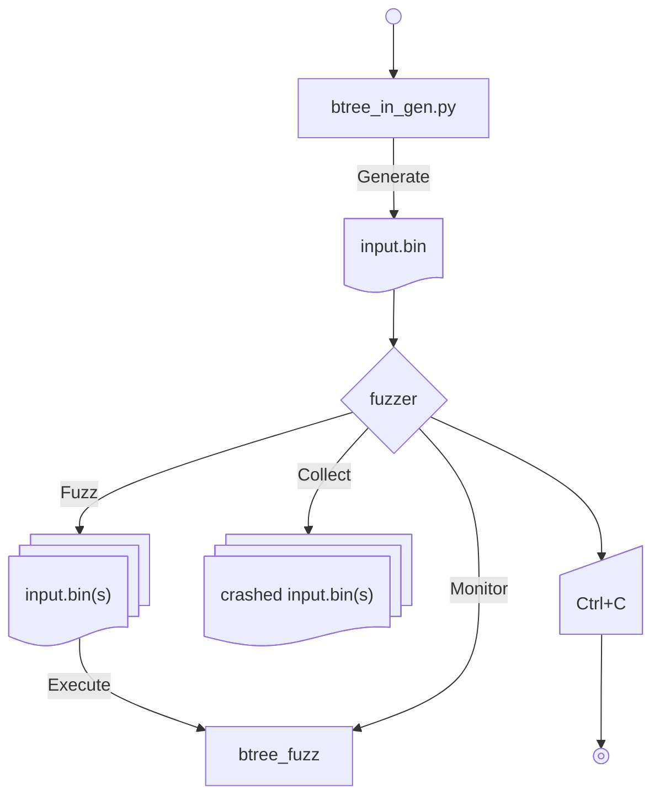

# Fuzz testing life-cycle



# Caveats

- Kaitai Struct does not provide C runtime. Executables employing Kaitai Struct has to be written in C++.
- The DAOS source code does not follow standard C++ requirements. It requires slight adjustments here and there.
- One still has to write a unit test type of binary which requires a little bit of understanding of the matter at hand.

# Rejected alternatives

Other tested solutions proved to add metadata which is too easy to break with a random bit-flop.

**WARNING**: The explanation of the metadata was taken from AI. References are needed. But the problem is real and verified. The metadata is there.

## Protobuf
tags = field_id << 3 + wire_type
very easy to break by a random bit-flop

## Flatbuffer

root_type has to be a table
table has a complex structure too easy to break by a random bit-flop

```
[ vtable_length ]
[ object_length ]
[ offset_of_field_0 ]
[ offset_of_field_1 ]
[ offset_of_field_2 ]
...
```

## Cap'n Proto

The segment table is too easy to break

```
[segment table]  
[segment 0 data]  
```
